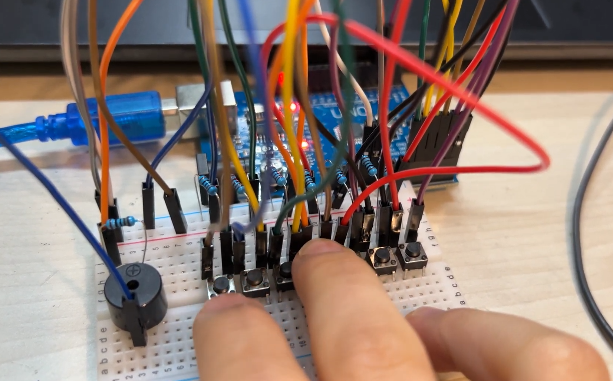

# Electronic-Piano
 Design and build a digital piano using an Arduino MCU

## Overview

Designed and implemented a digital piano system using an Arduino Uno microcontroller, push-button inputs, and a buzzer output module. The project focused on basic circuit interfacing, digital input processing, and audio signal generation using embedded systems programming.

The piano consists of seven input keys corresponding to musical notes (C, D, E, F, G, A, and B). When a key is pressed, the Arduino generates a square-wave signal at the corresponding frequency to produce the musical tone through the buzzer.

## Demo

Click the image above to watch the demo video!

  

## Key Features
-digital input handling
-frequency generation
-buzzer control
-waveform timing
-embedded programming
-simple circuit interfacing
## Hardware Used
- Arduino Uno Microcontroller
- Breadboard Prototyping Circuit
- Push Buttons (Piano Keys)
- Piezo Buzzer
- Resistors
- Jumper Wires

## Hardware Setup

## Source Code

Use pin 3 as the output to the buzzer. Connect pin 3 to a buzzer.
Pin 2 and pins Analog0 to Analog5 are used as the inputs from the keyboard. 
The keyboard is composed of several keys (switches). 

The complete embedded control program is available in the `src/` directory.

## Technologies Used

- C++ / Arduino Programming
- Embedded Systems Programming
- Digital Input Processing
- Frequency-Based Audio Signal Generation
- Square-Wave Signal Generation
- Basic Circuit Design
